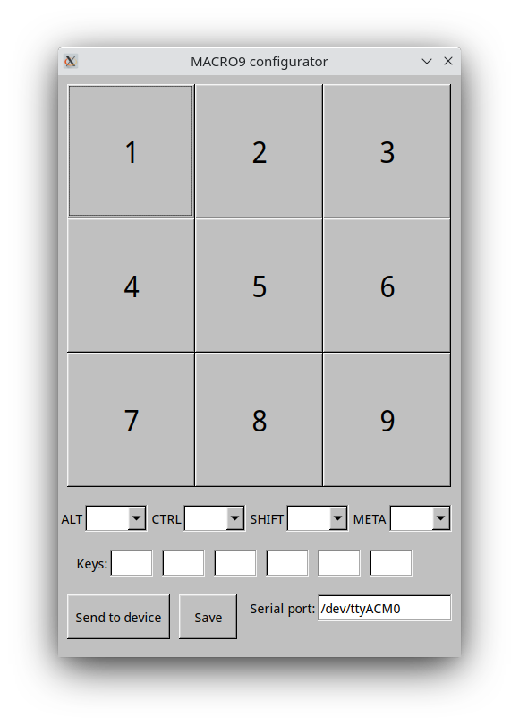

# MACRO9 Configurator

This is a graphical configurator for the [MACRO9 keypad](https://github.com/paunstefan/macro9).

## Usage

After starting the program, add the serial port path if it isn't filled already 
(if the keypad is plugged and you are using Linux, it should be detected automatically).

Select one of the keys and set the keys and modifiers you want, after you're finished 
with the key, click `Save` and go to the next key. When you're finished, click `Send to device`,
a message should appear to tell you if the transfer was successful.